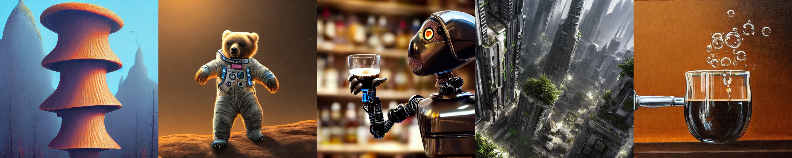
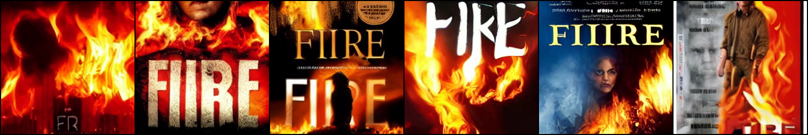
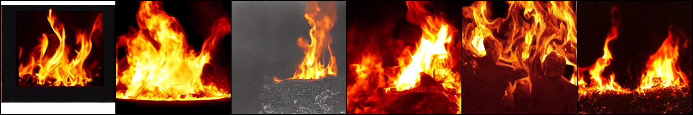
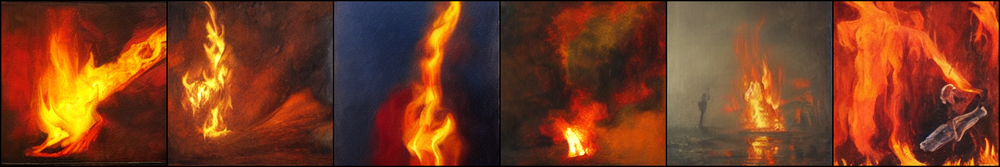
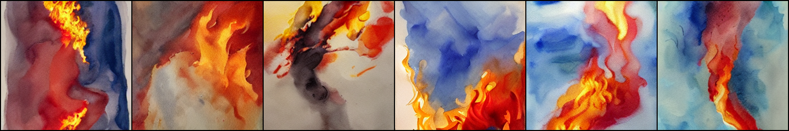
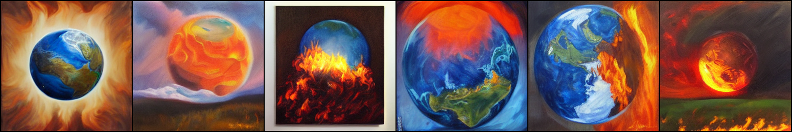
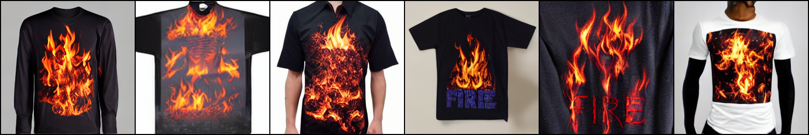
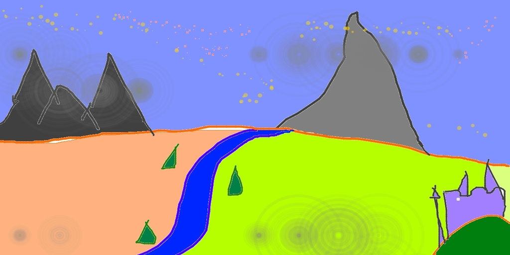
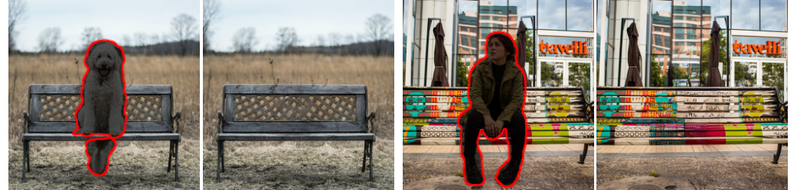

# Stable Diffusion — 潜空间扩散模型实验

*Stable Diffusion 由 [Stability AI](https://stability.ai/) 和 [Runway](https://runwayml.com/) 协作完成，基于以下研究工作：*

[**High-Resolution Image Synthesis with Latent Diffusion Models**](https://ommer-lab.com/research/latent-diffusion-models/)<br/>
[Robin Rombach](https://github.com/rromb)\*,
[Andreas Blattmann](https://github.com/ablattmann)\*,
[Dominik Lorenz](https://github.com/qp-qp),
[Patrick Esser](https://github.com/pesser),
[Björn Ommer](https://hci.iwr.uni-heidelberg.de/Staff/bommer)<br/>
_[CVPR '22 Oral](https://openaccess.thecvf.com/content/CVPR2022/html/Rombach_High-Resolution_Image_Synthesis_With_Latent_Diffusion_Models_CVPR_2022_paper.html) |
[GitHub](https://github.com/CompVis/latent-diffusion) | [arXiv](https://arxiv.org/abs/2112.10752) | [Project page](https://ommer-lab.com/research/latent-diffusion-models/)_

---

## 一、项目简介


Stable Diffusion 是一种**潜空间文本到图像的扩散模型**（Latent Text-to-Image Diffusion Model）。得益于 [Stability AI](https://stability.ai/) 提供的算力支持和 [LAION](https://laion.ai/) 的数据贡献，该模型在 [LAION-5B](https://laion.ai/blog/laion-5b/) 数据库的子集上完成了 512×512 分辨率的训练。

模型采用冻结的 **CLIP ViT-L/14** 文本编码器对文本提示进行条件化控制，���结构如图所示：


**核心组件**：

| 组件 | 参数量 | 作用 |
|------|--------|------|
| **UNet**（去噪网络） | 860M | 在潜空间中预测并去除噪声，是生成图像的核心。内含 ResBlock + Self-Attention + Cross-Attention |
| **CLIP 文本编码器** | 123M | 将文字描述编码为 768 维条件向量，通过交叉注意力注入 UNet |
| **VAE**（自编码器） | 83M | 图像 ↔ 潜空间的压缩/解压，下采样因子为 8（512×512 → 64×64×4） |

模型相对轻量，在 **10GB 显存以上**的 GPU 上即可运行。详见 [模型卡片](https://huggingface.co/CompVis/stable-diffusion)。

---

## 二、Stable Diffusion v1 权重

Stable Diffusion v1 采用**下采样因子 8 的自编码器 + 860M UNet + CLIP ViT-L/14 文本编码器**的架构。模型先以 256×256 分辨率预训练，再以 512×512 分辨率微调。

官方提供了以下四个版本的预训练权重，各版本之间为**逐步迭代**关系：

| 版本 | 训练数据 | 训练细节 |
|------|---------|---------|
| `sd-v1-1.ckpt` | [laion2B-en](https://huggingface.co/datasets/laion/laion2B-en) + [laion-high-resolution](https://huggingface.co/datasets/laion/laion-high-resolution) | 256×256 训练 237k 步 → 512×512 训练 194k 步 |
| `sd-v1-2.ckpt` | [laion-aesthetics v2 5+](https://laion.ai/blog/laion-aesthetics/)（美学评分>5.0，分辨率≥512，水印概率<0.5） | 从 v1-1 恢复，512×512 训练 515k 步 |
| `sd-v1-3.ckpt` | laion-aesthetics v2 5+ | 从 v1-2 恢复，训练 195k 步，**10% 文本条件丢弃**（提升 CFG 效果） |
| **`sd-v1-4.ckpt`**（本项目使用） | laion-aesthetics v2 5+ | 从 v1-2 恢复，训练 225k 步，**10% 文本条件丢弃** |

以下为不同 Classifier-Free Guidance Scale（1.5~8.0）、50 步 PLMS 采样下各版本的 FID/IS 评估对比：


> **本项目使用 `sd-v1-4.ckpt`**，它是目前质量最优的 v1 开源权重。

### 官方示例输出

以下图片均为 Stable Diffusion 原始模型生成的示例，展示了模型对不同 prompt 的理解能力：

**文字→图像示例**（prompt: "a photograph of an astronaut riding a horse" 等）：




**同一主题不同表达的生成对比**（prompt 均围绕 "fire" 主题）：

| prompt | 生成结果 |
|--------|---------|
| "fire" |  |
| "a photograph of a fire" |  |
| "a painting of a fire" |  |
| "a watercolor painting of a fire" |  |
| "the earth is on fire, oil on canvas" |  |
| "a shirt with a fire printed on it" |  |

可以看到，模型能够区分**摄影（photograph）、油画（painting）、水彩（watercolor）、印花T恤（shirt with print）**等不同视觉风格。

**图像→图像示例**（草图转艺术画）：

输入草图：



输出效果：


**图像修复示例**：



---

## 三、Google Colab 环境配置

本项目已在 **Google Colab**（Python 3.12、PyTorch 2.x、CUDA T4 15GB）上完成验证。由于原项目依赖��旧版本的库，需要进行兼容性修复。

### Cell 1：克隆仓库

```python
!git clone https://github.com/hexuanJ/DM.git
%cd /content/DM
```

### Cell 2：安装依赖 + 一次性修复兼容性问题

> 本 Cell 具有**幂等性**（无论运行多少次结果相同），解决以下兼容性问题：
>
> | 问题 | 原因 | 修复方式 |
> |------|------|---------|
> | `torch._six` 不存在 | PyTorch 2.x 移除了该内部模块 | 替换为 `string_classes = (str,)` |
> | `AutoFeatureExtractor` 已弃用 | transformers 新版改名 | 仅在 `scripts/` 中替换为 `CLIPImageProcessor` |
> | `torch.load` 安全警告 | PyTorch 2.x 新增安全机制 | 添加 `weights_only=False` |
> | `Trainer.add_argparse_args` 不存在 | PyTorch Lightning 2.x 移除了该方法 | 锁定安装 `pytorch-lightning==1.9.5` |

```python
# ===== 安装依赖 =====
!pip install -q transformers diffusers invisible-watermark \
    omegaconf einops pytorch-lightning==1.9.5 \
    kornia torchmetrics open_clip_torch albumentations accelerate
!pip install -q -e git+https://github.com/CompVis/taming-transformers.git@master#egg=taming-transformers
!pip install -q -e git+https://github.com/openai/CLIP.git@main#egg=clip
!pip install -q -e .

# ===== 一次性修复所有兼容性问题 =====
import glob

FIXES = [
    ('from torch._six import string_classes', 'string_classes = (str,)'),
    ('torch.load(ckpt, map_location="cpu")',  'torch.load(ckpt, map_location="cpu", weights_only=False)'),
    ('torch.load(path, map_location="cpu")',  'torch.load(path, map_location="cpu", weights_only=False)'),
    ('torch.load("models/ldm/inpainting_big/last.ckpt")',
     'torch.load("models/ldm/inpainting_big/last.ckpt", map_location="cpu", weights_only=False)'),
]
SCRIPT_FIXES = [
    ('from transformers import AutoFeatureExtractor', 'from transformers import CLIPImageProcessor'),
    ('AutoFeatureExtractor.from_pretrained',          'CLIPImageProcessor.from_pretrained'),
]
ENCODER_RESTORE = [
    ('from transformers import CLIPImageProcessor',   'from transformers import CLIPTokenizer, CLIPTextModel'),
]

for pyfile in glob.glob('**/*.py', recursive=True):
    with open(pyfile, 'r') as f:
        content = f.read()
    original = content
    for old, new in FIXES:
        content = content.replace(old, new)
    if pyfile.startswith('scripts/'):
        for old, new in SCRIPT_FIXES:
            content = content.replace(old, new)
    if pyfile == 'ldm/modules/encoders/modules.py':
        for old, new in ENCODER_RESTORE:
            content = content.replace(old, new)
    content = content.replace('weights_only=False, weights_only=False', 'weights_only=False')
    if content != original:
        with open(pyfile, 'w') as f:
            f.write(content)

print("✅ 完成")
```

### Cell 3：下载 Stable Diffusion v1-4 权重

```python
!mkdir -p models/ldm/stable-diffusion-v1/
!wget -q --show-progress -O models/ldm/stable-diffusion-v1/model.ckpt \
    "https://huggingface.co/CompVis/stable-diffusion-v-1-4-original/resolve/main/sd-v1-4.ckpt"
print("✅ SD v1-4 权重下载完成")
```

> 权重文件约 4GB。首次运行 txt2img 时还会自动下载 CLIP 文本编码器（~1.7GB）和 Safety Checker（~1.2GB），它们会被缓存到 `/root/.cache/huggingface/`，后续运行无需重新下载。

---

## 四、任务实现

本项目完成了以下四个任务，均在 Google Colab T4 GPU（15GB VRAM）上验证通过。

---

### 任务一：文字生成图像（Text-to-Image）

**任务内容**：输入一段自然语言文字描述（prompt），模型从纯高斯噪声出发，经过反复去噪，生成与描述语义匹配的 512×512 图像。

**工作流程**：

```
                    "a photograph of an astronaut riding a horse"
                                      │
                                      ▼
                           ┌─────────────────────┐
                           │  CLIP ViT-L/14       │
                           │  冻结文本编码器       │
                           └─────────┬───────────┘
                                     │ 768 维条件向量
                                     ▼
  纯噪声 z_T ──→ UNet 去噪（50步）←──交叉注意力──── 文本条件
                    │
                    ▼
              潜空间 z_0 ──→ VAE 解码器 ──→ 512×512 RGB 图像
```

**运行代码（Cell 4）**：

```python
%cd /content/DM
!python scripts/txt2img.py \
    --prompt "a photograph of an astronaut riding a horse" \
    --plms --ddim_steps 50 --n_samples 1 --scale 7.5 --seed 42 \
    --outdir outputs/txt2img-samples

from IPython.display import Image as IPImage, display
import glob
for img in sorted(glob.glob("outputs/txt2img-samples/samples/*.png")):
    display(IPImage(img))
```

**参数详解**：

| 参数 | 默认值 | 含义与建议 |
|------|--------|-----------|
| `--prompt` | 必填 | 文字描述。越具体效果越好，建议包含主体、风格、质量修饰词（如 "photorealistic, 8k, sharp focus"） |
| `--plms` | 关闭 | 启用 [PLMS 采样器](https://arxiv.org/abs/2202.09778)（推荐），比默认 DDIM 更快且质量更好 |
| `--dpm_solver` | 关闭 | 启用 DPM-Solver 采样器，可用更少步数（如 25 步）达到同等质量 |
| `--ddim_steps` | 50 | 去噪步数。越多质量越好但越慢。PLMS 推荐 50 步，DPM-Solver 推荐 25 步 |
| `--n_samples` | 3 | 每个 prompt 生成几张图。Colab T4 显存有限，建议设为 1-2 |
| `--n_iter` | 2 | 采样迭代次数。总生成图数 = n_samples × n_iter |
| `--scale` | 7.5 | Classifier-Free Guidance 引导系数。越大越严格遵循 prompt，但太大（>15）会导致图像过饱和。**推荐范围 5-12** |
| `--seed` | 42 | 随机种子。相同 seed + 相同参数 = 完全相同的输出，方便复现 |
| `--H` / `--W` | 512 | 输出图像高/宽（像素），必须是 64 的倍数。模型在 512×512 上训练，其他尺寸可能效果下降 |
| `--C` | 4 | 潜空间通道数（固定为 4，不建议修改） |
| `--f` | 8 | 下采样因子（固定为 8，与 VAE 架构对应） |
| `--from-file` | 无 | 从文件批量读取 prompt，每行一个。适合大量生成 |
| `--precision` | autocast | 推理精度。`autocast` 使用 FP16 混合精度加速，`full` 使用 FP32 |
| `--config` | `configs/stable-diffusion/v1-inference.yaml` | 模型配置文件路径 |
| `--ckpt` | `models/ldm/stable-diffusion-v1/model.ckpt` | 模型权重路径 |

**任务结果**：模型成功生成了宇航员骑马的照片风格图像，耗时约 15-20 秒（T4 GPU）。

---

### 任务二：图像到图像（Image-to-Image）

**任务内容**：输入一张参考图�� + 文字描述，模型以参考图为起点进行"重绘"，可实现风格迁移、内容修改、细节增强等效果。

**与 txt2img 的核心区别**：

```
txt2img：从 100% 纯噪声开始 ──→ 完全由文字控制
img2img：从 输入图 + 部分噪声 开始 ──→ 保留原图结构，文字引导修改

具体流程：
  输入图片 ──→ VAE 编码 ──→ 潜空间表示 z_0
                                │
                  加入 strength 比例的噪声 ──→ z_t（t = strength × T）
                                │
  prompt ──→ CLIP ──→ 交叉注意力 ──→ UNet 从 z_t 开始去噪
                                │
                        VAE 解码 ──→ 输出图像
```

**运行代码（Cell 5）**：

```python
%cd /content/DM
!python scripts/img2img.py \
    --prompt "a girl with black hair, beautiful face, photorealistic, 8k" \
    --init-img data/inpainting_examples/bench2.png \
    --strength 0.4 --ddim_steps 75 --n_samples 1 --scale 10.0 \
    --outdir outputs/img2img-samples

from IPython.display import Image as IPImage, display
import glob
for img in sorted(glob.glob("outputs/img2img-samples/samples/*.png")):
    display(IPImage(img))
```

**关键参数**：

| 参数 | 默认值 | 含义 |
|------|--------|------|
| `--init-img` | 必填 | 输入参考图片路径 |
| `--strength` | 0.75 | 噪声强度（0.0~1.0）。**这是 img2img 最重要的参数** |

**strength 参数效果对照**：

| strength | 效果描述 | 适用场景 |
|----------|---------|---------|
| 0.1~0.3 | 几乎不变，仅微调色调/亮度 | 色彩校正 |
| 0.3~0.5 | 保留主体结构，细节可被改变 | **人像美化、风格微调（推荐）** |
| 0.5~0.7 | 构图大致保留，内容明显变化 | 风格迁移 |
| 0.7~1.0 | 几乎完全重绘，仅保留大致色调 | 创意生成 |

**任务结果**：以 `bench2.png` 为输入，strength=0.4，成功生成了保留原图构图但符合 prompt 描述的人像图片。

---

### 任务三：Diffusers 集成（最简方式）

**任务内容**：使用 Hugging Face [diffusers](https://github.com/huggingface/diffusers) 库，以最少的代码完成 Stable Diffusion 推理。

**与原始脚本的对比**：

| 对比项 | 原始脚本 `txt2img.py` | Diffusers 集成 |
|--------|----------------------|----------------|
| 代码量 | ~350 行 | ~10 行 |
| 权重管理 | 手动下载 4GB `.ckpt` | 自动从 HuggingFace Hub 下载并缓存 |
| Safety Checker | 手动初始化 | 内置，自动运行 |
| 负面提示词 | 不支持 | ✅ `negative_prompt` 参数 |
| FP16 推理 | `--precision autocast` | `torch_dtype=torch.float16` |
| 返回值 | 保存到文件系统 | 直接返回 PIL Image 对象 |

> **注意**：原 README 中的 `pipe(prompt)["sample"][0]` 在新版 diffusers 中已改为 `pipe(prompt).images[0]`。

**运行代码（Cell 6）**：

```python
import torch
from diffusers import StableDiffusionPipeline

pipe = StableDiffusionPipeline.from_pretrained(
    "CompVis/stable-diffusion-v1-4", torch_dtype=torch.float16
).to("cuda")

image = pipe("a photo of an astronaut riding a horse on mars").images[0]
image.save("diffusers_result.png")

from IPython.display import Image as IPImage, display
display(IPImage("diffusers_result.png"))
```

**任务结果**：成功生成火星上宇航员骑马的图像，代码极其简洁，首次运行需从 HuggingFace 下载模型（约 5GB，自动缓存）。

---

### 任务四：图像修复（Inpainting）

**任务内容**：给定一张图片和一个 mask（白色标记需要修复的区域），模型自动填充 mask 覆盖的区域，使其与周围内容自然融合。


**工作流程**：

```
  原始图片 ──────────┐
                    ├──→ masked_image = (1 - mask) × image
  mask（黑白图）────┘
                              │
                    VAE 编码 + mask 下采样 → 拼接为条件输入
                              │
                    UNet 在 mask 区域生成新内容
                              │
                    VAE 解码
                              │
                    最终输出 = 原图未mask部分 + 生成的mask部分
```

**输入数据格式**：`--indir` 目录下需要**成对文件**：

```
bench2.png           ← 原始图片（RGB）
bench2_mask.png      ← 对应 mask（白色=要修复，黑色=保留）
```

项目在 `data/inpainting_examples/` 下自带了 8 对示例图片。

> **注意**：图像修复使用**独立的预训练权重**（387M 参数，VQ-f4 架构，约 3GB），与 txt2img/img2img 使用的 SD v1-4 权重不同。运行前需释放其他模型占用的 GPU 显存。

**运行代码（Cell 7）**：

```python
import torch, gc, shutil
try: del pipe
except: pass
gc.collect(); torch.cuda.empty_cache()

%cd /content/DM

# 下载 inpainting 专用权重（约 3GB）
!mkdir -p models/ldm/inpainting_big
!wget -q --show-progress -O models/ldm/inpainting_big/model.zip \
    https://ommer-lab.com/files/latent-diffusion/inpainting_big.zip
!cd models/ldm/inpainting_big && unzip -o model.zip
shutil.copy("models/ldm/inpainting_big/model.zip", "models/ldm/inpainting_big/last.ckpt")

# 运行修复
!python scripts/inpaint.py \
    --indir data/inpainting_examples --outdir outputs/inpainting --steps 50

from IPython.display import Image as IPImage, display
import glob
for img in sorted(glob.glob("outputs/inpainting/*.png")):
    display(IPImage(img, width=512))
```

**参数说明**：

| 参数 | 默认值 | 含义 |
|------|--------|------|
| `--indir` | 必填 | 包含图片和对应 mask 的输入目录 |
| `--outdir` | 必填 | 修复结果的输出目录 |
| `--steps` | 50 | DDIM 采样步数 |

**任务结果**：模型成功处理了 8 对示例输入，对 mask 区域进行了语义合理的填充，边缘过渡自然。

---

## 五、项目结构

```
DM/
├── README.md                           # 本文档
├── LICENSE                             # CreativeML OpenRAIL M 许可证
├── Stable_Diffusion_v1_Model_Card.md   # 模型卡片（训练数据、偏见、限制等）
├── setup.py                            # Python 包安装配置
├── environment.yaml                    # Conda 环境配置（本项目使用 pip 替代）
├── main.py                             # 训练/微调入口脚本
├── notebook_helpers.py                 # Notebook 辅助函数
│
├── scripts/                            # 推理脚本
│   ├── txt2img.py                      #   任务一：文字 → 图像
│   ├── img2img.py                      #   任务二：图像 → 图像
│   └── inpaint.py                      #   任务四：图像修复
│
├── ldm/                                # 模型核心代码
│   ├── models/
│   │   ├── diffusion/
│   │   │   ├── ddpm.py                 #   LatentDiffusion 主类（训练+推理逻辑）
│   │   │   ├── ddim.py                 #   DDIM 采样器
│   │   │   ├── plms.py                 #   PLMS 采样器
│   │   │   └── dpm_solver/             #   DPM-Solver 采样器
│   │   └── autoencoder.py              #   VAE / VQ-VAE 编码器解码器
│   └── modules/
│       ├── attention.py                #   CrossAttention / SpatialTransformer
│       ├── diffusionmodules/
│       │   └── openaimodel.py          #   UNetModel（860M 参数去噪网络）
│       └── encoders/
���           └── modules.py              #   FrozenCLIPEmbedder（CLIP 文本编码器封装）
│
├── configs/
│   └── stable-diffusion/
│       └── v1-inference.yaml           # SD v1 推理配置
│
├── models/ldm/stable-diffusion-v1/     # 权重存放目录
│   └── model.ckpt                      #   SD v1-4 权重（需下载，约 4GB）
│
├── data/
│   └── inpainting_examples/            # 图像修复示例数据（8 对图片 + mask）
│
└── assets/                             # README 中引用的示例图片
    ├── modelfigure.png                 #   模型架构图
    ├── v1-variants-scores.jpg          #   各版本评估对比
    ├── stable-samples/txt2img/         #   txt2img 官方示例
    ├── stable-samples/img2img/         #   img2img 官方示例（含草图输入）
    ├── inpainting.png                  #   inpainting 效果示例
    ├── fire.png, a-painting-of-a-fire.png, ...  # 同主题不同风格对比
    └── rick.jpeg                       #   NSFW 替换占位图
```

---

## 六、致谢

- 扩散模型代码基于 [OpenAI 的 ADM 代码库](https://github.com/openai/guided-diffusion) 和 [lucidrains/denoising-diffusion-pytorch](https://github.com/lucidrains/denoising-diffusion-pytorch)
- Transformer 编码器实现来自 [x-transformers](https://github.com/lucidrains/x-transformers)（[lucidrains](https://github.com/lucidrains)）

## 引用

```bibtex
@misc{rombach2021highresolution,
      title={High-Resolution Image Synthesis with Latent Diffusion Models},
      author={Robin Rombach and Andreas Blattmann and Dominik Lorenz and Patrick Esser and Björn Ommer},
      year={2021},
      eprint={2112.10752},
      archivePrefix={arXiv},
      primaryClass={cs.CV}
}
```
# Stable Diffusion — 模型原理与代码详解

基于仓库 `hexuanJ/DM` 中的实际代码，逐文件、逐模块详细介绍所使用的全部模型组件、数学原理及代码实现。

---

## 一、整体架构总览

Stable Diffusion 由 **三个独立的神经网络模型** 协同工作：

```
用户输入: "a photograph of an astronaut riding a horse"
                            │
                   ┌────────▼─────────┐
                   │ 模型③ CLIP 文本   │  冻结，123M 参数
                   │ 编码器            │  将文字转为 768 ���向量序列
                   │ FrozenCLIPEmbedder│  输出: [1, 77, 768]
                   └────────┬─────────┘
                            │ 通过「交叉注意力」注入
                            ▼
纯噪声 z_T ──→ ┌──────────────────────────────────┐
[1,4,64,64]    │ 模型② UNet 去噪网络               │  860M 参数
               │ 输入: 带噪潜表示 z_t + 时间步 t    │
               │       + CLIP 文本条件              │
               │ 输出: 预测的噪声 ε_θ(z_t, t, c)   │
               │ 迭代 50 步逐渐去噪                 │
               └──────────┬───────────────────────┘
                          │
                   去噪后 z_0 [1, 4, 64, 64]
                          │
                ┌─────────▼──────────┐
                │ 模型① VAE 解码器    │  83M 参数
                │ AutoencoderKL      │  将潜空间还原为像素
                │ 64×64×4 → 512×512×3│
                └─────────┬──────────┘
                          │
                          ▼
                  512×512 RGB 图像
```

**为什么在「潜空间」而非「像素空间」做扩散？**

直接在 512×512×3 像素上做扩散，每步要处理 786,432 维数据；而在 64×64×4 潜空间中只需处理 16,384 维数据，计算量降低 **约 48 倍**，这就是"Latent Diffusion Model"名称的由来。

---

## 二、模型①：VAE 自编码器（��一阶段模型）

### 2.1 数学原理

VAE（Variational Autoencoder，变分自编码器）学习一个双向映射：

```
编码器 E：图像 x (512×512×3) → 高斯分布参数 (μ, σ) → 采样得到 z (64×64×4)
解码器 D：潜表示 z (64×64×4) → 重建图像 x̂ (512×512×3)

采样过程（重参数化技巧）：z = μ + σ · ε,  其中 ε ~ N(0, I)
```

训练目标是最小化：
```
L_VAE = L_重建(x, x̂) + λ_KL · KL(q(z|x) || N(0,I)) + L_感知(LPIPS) + L_对抗(PatchGAN)
```

- **重建损失**：像素级 L1/L2，让解码器输出尽量接近原图
- **KL 散度**：让潜空间分布接近标准正态分布，保证可采样性
- **感知损失 LPIPS**：基于 VGG 特征的感知相似度，让重建图在人眼看来更自然
- **对抗损失**：用 PatchGAN 判别器区分真实/重建图像，提升纹理真实感

### 2.2 代码实现

**文件**：`ldm/models/autoencoder.py` → `AutoencoderKL` 类

在 `LatentDiffusion` 中被初始化和调用：

```python name=ldm/models/diffusion/ddpm.py url=https://github.com/hexuanJ/DM/blob/0ef29d6ea866333799417eddca536518a9d4ef4a/ldm/models/diffusion/ddpm.py#L502-L507
def instantiate_first_stage(self, config):
    model = instantiate_from_config(config)
    self.first_stage_model = model.eval()          # 设为推理模式
    self.first_stage_model.train = disabled_train   # 禁止切换回训练模式
    for param in self.first_stage_model.parameters():
        param.requires_grad = False                 # 冻结全部参数
```

**编码过程**（图像 → 潜空间）：

```python name=ldm/models/diffusion/ddpm.py url=https://github.com/hexuanJ/DM/blob/0ef29d6ea866333799417eddca536518a9d4ef4a/ldm/models/diffusion/ddpm.py#L825-L863
@torch.no_grad()
def encode_first_stage(self, x):
    # x: [B, 3, 512, 512] RGB 图像
    return self.first_stage_model.encode(x)
    # 返回 DiagonalGaussianDistribution 对象，包含 μ 和 log(σ²)
```

```python name=ldm/models/diffusion/ddpm.py url=https://github.com/hexuanJ/DM/blob/0ef29d6ea866333799417eddca536518a9d4ef4a/ldm/models/diffusion/ddpm.py#L542-L549
def get_first_stage_encoding(self, encoder_posterior):
    if isinstance(encoder_posterior, DiagonalGaussianDistribution):
        z = encoder_posterior.sample()     # z = μ + σ·ε（重参数化采样）
    elif isinstance(encoder_posterior, torch.Tensor):
        z = encoder_posterior
    return self.scale_factor * z           # 乘以 0.18215 缩放到合适范围
```

> `scale_factor = 0.18215` 是预训练时统计得到的潜空间标准差的倒数，确保潜空间数值范围适合扩散过程。

**解码过程**（潜空间 → 图像）：

```python name=ldm/models/diffusion/ddpm.py url=https://github.com/hexuanJ/DM/blob/0ef29d6ea866333799417eddca536518a9d4ef4a/ldm/models/diffusion/ddpm.py#L705-L713
@torch.no_grad()
def decode_first_stage(self, z, ...):
    z = 1. / self.scale_factor * z         # 反缩放
    return self.first_stage_model.decode(z) # 64×64×4 → 512×512×3
```

### 2.3 在四个任务中的角色

| 任务 | 编码器 E | 解码器 D |
|------|---------|---------|
| txt2img | ✗ 不使用（从���噪声开始） | ✓ 最后将 z_0 解码为图像 |
| img2img | ✓ 将输入图编码为 z_0 | ✓ 最后将去噪结果解码 |
| inpainting | ✓ 将原图编码为条件 | ✓ 最后将修复结果解码 |
| diffusers | ✓/✗ 内部封装 | ✓ 内部封装 |

---

## 三、模型②：UNet 去噪网络（扩散核心）

### 3.1 DDPM 扩散模型数学原理

扩散模型包含两个方向的马尔可夫过程：

#### 前向过程（加噪）

给定干净数据 z₀，逐步添加高斯噪声，经过 T=1000 步后变为纯噪声：

```
q(z_t | z_0) = N(z_t;  √ᾱ_t · z_0,  (1 - ᾱ_t) · I)
```

其中：
- `β_t`：第 t 步的噪声强度，由线性调度表定义（从 0.00085 线性增长到 0.012）
- `α_t = 1 - β_t`
- `ᾱ_t = α₁ · α₂ · ... · α_t`（累积乘积）

代码实现：

```python name=ldm/models/diffusion/ddpm.py url=https://github.com/hexuanJ/DM/blob/0ef29d6ea866333799417eddca536518a9d4ef4a/ldm/models/diffusion/ddpm.py#L117-L169
def register_schedule(self, given_betas=None, beta_schedule="linear", timesteps=1000, ...):
    betas = make_beta_schedule(beta_schedule, timesteps, ...)  # 生成 β₁...β_T
    alphas = 1. - betas                                         # α_t = 1 - β_t
    alphas_cumprod = np.cumprod(alphas, axis=0)                 # ᾱ_t = Π α_s
    alphas_cumprod_prev = np.append(1., alphas_cumprod[:-1])    # ᾱ_{t-1}

    # 预计算并缓存所有常用系数（避免推理时重复计算）：
    self.register_buffer('sqrt_alphas_cumprod', ...)        # √ᾱ_t
    self.register_buffer('sqrt_one_minus_alphas_cumprod', ...)  # √(1-ᾱ_t)
    self.register_buffer('sqrt_recip_alphas_cumprod', ...)      # 1/√ᾱ_t
    self.register_buffer('sqrt_recipm1_alphas_cumprod', ...)    # √(1/ᾱ_t - 1)

    # 后验分布参数（用于 DDPM 采样）：
    posterior_variance = (1 - v_posterior) * β_t * (1 - ᾱ_{t-1}) / (1 - ᾱ_t) + v_posterior * β_t
    self.register_buffer('posterior_mean_coef1', ...)   # β_t·√ᾱ_{t-1} / (1-ᾱ_t)
    self.register_buffer('posterior_mean_coef2', ...)   # (1-ᾱ_{t-1})·√α_t / (1-ᾱ_t)
```

**一步加噪函数**（可从 z₀ 直接跳到任意 z_t，无需逐步进行）：

```python name=ldm/models/diffusion/ddpm.py url=https://github.com/hexuanJ/DM/blob/0ef29d6ea866333799417eddca536518a9d4ef4a/ldm/models/diffusion/ddpm.py#L274-L277
def q_sample(self, x_start, t, noise=None):
    noise = default(noise, lambda: torch.randn_like(x_start))
    return (extract_into_tensor(self.sqrt_alphas_cumprod, t, x_start.shape) * x_start +
            extract_into_tensor(self.sqrt_one_minus_alphas_cumprod, t, x_start.shape) * noise)
    # z_t = √ᾱ_t · z_0 + √(1-ᾱ_t) · ε
```

#### 反向过程（去噪）

UNet 学习预测加入的噪声 ε，然后用这个预测反推出 z₀：

```
ε_θ(z_t, t, c) ← UNet 输出（预测噪声）
ẑ_0 = (z_t - √(1-ᾱ_t) · ε_θ) / √ᾱ_t    ← 从预测噪声还原 z_0
```

```python name=ldm/models/diffusion/ddpm.py url=https://github.com/hexuanJ/DM/blob/0ef29d6ea866333799417eddca536518a9d4ef4a/ldm/models/diffusion/ddpm.py#L216-L220
def predict_start_from_noise(self, x_t, t, noise):
    return (
        extract_into_tensor(self.sqrt_recip_alphas_cumprod, t, x_t.shape) * x_t -
        extract_into_tensor(self.sqrt_recipm1_alphas_cumprod, t, x_t.shape) * noise
    )
    # ẑ_0 = (1/√ᾱ_t) · z_t - √(1/ᾱ_t - 1) · ε_θ
```

#### 训练损失

```python name=ldm/models/diffusion/ddpm.py url=https://github.com/hexuanJ/DM/blob/0ef29d6ea866333799417eddca536518a9d4ef4a/ldm/models/diffusion/ddpm.py#L1012-L1045
def p_losses(self, x_start, cond, t, noise=None):
    noise = default(noise, lambda: torch.randn_like(x_start))
    x_noisy = self.q_sample(x_start=x_start, t=t, noise=noise)     # 1. 对 z_0 加噪得到 z_t
    model_output = self.apply_model(x_noisy, t, cond)                # 2. UNet 预测噪声
    target = noise  # eps-prediction 模式：目标就是真实噪声 ε
    loss_simple = self.get_loss(model_output, target, mean=False).mean([1, 2, 3])
    # L = E_{t,ε}[ ||ε - ε_θ(z_t, t, c)||² ]   ← 简单 MSE 损失
```

### 3.2 UNet 网络结构

**文件**：`ldm/modules/diffusionmodules/openaimodel.py` → `UNetModel`

```
输入 z_t [B, 4, 64, 64] + timestep t + context c [B, 77, 768]
│
├─ 时间步嵌入：t → 正弦位置编码 → MLP → [B, 1280]
│
├─ 下采样路径（Encoder）：
│   ├─ 64×64: ResBlock×2 + SpatialTransformer×2 (320ch)
│   ├─ 32×32: ResBlock×2 + SpatialTransformer×2 (640ch)
│   ├─ 16×16: ResBlock×2 + SpatialTransformer×2 (1280ch)
│   └─  8×8:  ResBlock×2                         (1280ch)
│
├─ 中间层（Bottleneck）：
│   └─  8×8:  ResBlock + SpatialTransformer + ResBlock (1280ch)
│
├─ 上采样路径（Decoder）+ Skip Connection：
│   ├─  8×8 → 16×16: ResBlock×3 + SpatialTransformer×2 (1280ch)
│   ├─ 16×16 → 32×32: ResBlock×3 + SpatialTransformer×2 (640ch)
│   └─ 32×32 → 64×64: ResBlock×3 + SpatialTransformer×2 (320ch)
│
└─ 输出层：GroupNorm → SiLU → Conv2d → [B, 4, 64, 64]（预测的噪声）
```

**每个 SpatialTransformer 内部**（`ldm/modules/attention.py`）：

```
输入特征 x [B, C, H, W]
│
├─ Self-Attention：x 自己跟自己做注意力（学习图像内部空间关系）
│   Q = W_q · x,  K = W_k · x,  V = W_v · x
│   Attention(Q, K, V) = softmax(QK^T / √d) · V
│
├─ Cross-Attention：x 跟文本条件 c 做注意力（这是文字控制图像的关键！）
│   Q = W_q · x,  K = W_k · c,  V = W_v · c      ← c 来自 CLIP
│   Attention(Q, K, V) = softmax(QK^T / √d) · V
│
└─ Feed-Forward：GEGLU 激活 + 线性层
```

> **Cross-Attention 是 Stable Diffusion 的灵魂**：图像特征作为 Query，文本嵌入作为 Key 和 Value，让模型学会"哪些图像区域应该对应哪些文字"。

### 3.3 DiffusionWrapper — 条件注入路由

**文件**：`ldm/models/diffusion/ddpm.py` 第 1395-1421 行

```python name=ldm/models/diffusion/ddpm.py url=https://github.com/hexuanJ/DM/blob/0ef29d6ea866333799417eddca536518a9d4ef4a/ldm/models/diffusion/ddpm.py#L1395-L1421
class DiffusionWrapper(pl.LightningModule):
    def forward(self, x, t, c_concat=None, c_crossattn=None):
        if self.conditioning_key == 'crossattn':
            # ★ txt2img / img2img 使用此模式
            # 文本嵌入通过 UNet 中每个 SpatialTransformer 的 Cross-Attention 注入
            cc = torch.cat(c_crossattn, 1)
            out = self.diffusion_model(x, t, context=cc)

        elif self.conditioning_key == 'concat':
            # ★ inpainting 使用此模式
            # mask + masked_image 直接拼接到 z_t 的通道维度
            xc = torch.cat([x] + c_concat, dim=1)
            out = self.diffusion_model(xc, t)

        elif self.conditioning_key == 'hybrid':
            # concat + crossattn 同时使用（本项目未用到）
            xc = torch.cat([x] + c_concat, dim=1)
            cc = torch.cat(c_crossattn, 1)
            out = self.diffusion_model(xc, t, context=cc)
```

### 3.4 apply_model — 模型调用入口

```python name=ldm/models/diffusion/ddpm.py url=https://github.com/hexuanJ/DM/blob/0ef29d6ea866333799417eddca536518a9d4ef4a/ldm/models/diffusion/ddpm.py#L891-L992
def apply_model(self, x_noisy, t, cond, return_ids=False):
    # 将条件统一为 dict 格式
    if not isinstance(cond, list):
        cond = [cond]
    key = 'c_concat' if self.model.conditioning_key == 'concat' else 'c_crossattn'
    cond = {key: cond}
    # 调用 DiffusionWrapper
    x_recon = self.model(x_noisy, t, **cond)
    return x_recon  # 返回预测的噪声 ε_θ
```

---

## 四、模型③：CLIP 文本编码器（条件模型）

### 4.1 原理

CLIP（Contrastive Language-Image Pre-training）由 OpenAI 训练，通过对比学习让文本和图像共享同一嵌入空间。Stable Diffusion 使用其中的**文本编码器部分** `CLIP ViT-L/14`：

```
"a photo of an astronaut riding a horse"
    │
    ├─ Tokenizer：文字 → 77 个 token ID（不足补 padding，超长截断）
    │
    └─ Transformer（12 层）：token ID → 768 维嵌入向量
        │
        └─ 输出：[1, 77, 768]  ← 每个 token 的 768 维上下文表示
```

### 4.2 代码实现

**文件**：`ldm/modules/encoders/modules.py` → `FrozenCLIPEmbedder`

在 `LatentDiffusion` 中初始化：

```python name=ldm/models/diffusion/ddpm.py url=https://github.com/hexuanJ/DM/blob/0ef29d6ea866333799417eddca536518a9d4ef4a/ldm/models/diffusion/ddpm.py#L509-L528
def instantiate_cond_stage(self, config):
    if not self.cond_stage_trainable:
        model = instantiate_from_config(config)
        self.cond_stage_model = model.eval()          # 冻结为推理模式
        self.cond_stage_model.train = disabled_train
        for param in self.cond_stage_model.parameters():
            param.requires_grad = False               # 不参与训练
```

推理时的调用：

```python name=ldm/models/diffusion/ddpm.py url=https://github.com/hexuanJ/DM/blob/0ef29d6ea866333799417eddca536518a9d4ef4a/ldm/models/diffusion/ddpm.py#L551-L562
def get_learned_conditioning(self, c):
    # c = ["a photo of an astronaut riding a horse"]
    if hasattr(self.cond_stage_model, 'encode') and callable(self.cond_stage_model.encode):
        c = self.cond_stage_model.encode(c)   # → [1, 77, 768]
    else:
        c = self.cond_stage_model(c)
    return c
```

### 4.3 Classifier-Free Guidance（CFG）

推理时模型同时做两次前向传播——一次有文本条件、一次无条件（空字符串），然后用引导系数 `scale` 放大两者差异：

```
ε_guided = ε_uncond + scale × (ε_cond - ε_uncond)
```

代码实现在采样器中（以 DDIM 为例）：

```python name=ldm/models/diffusion/ddim.py url=https://github.com/hexuanJ/DM/blob/0ef29d6ea866333799417eddca536518a9d4ef4a/ldm/models/diffusion/ddim.py#L165-L178
def p_sample_ddim(self, x, c, t, index, ..., unconditional_guidance_scale=1.,
                  unconditional_conditioning=None):
    if unconditional_conditioning is None or unconditional_guidance_scale == 1.:
        e_t = self.model.apply_model(x, t, c)     # 仅条件推理
    else:
        x_in = torch.cat([x] * 2)                  # 拼接两份输入
        t_in = torch.cat([t] * 2)
        c_in = torch.cat([unconditional_conditioning, c])  # [空文本, 真文本]
        e_t_uncond, e_t = self.model.apply_model(x_in, t_in, c_in).chunk(2)
        e_t = e_t_uncond + unconditional_guidance_scale * (e_t - e_t_uncond)
        # ε_guided = ε_uncond + scale × (ε_cond - ε_uncond)
```

> `--scale 7.5` 就是这里的 `unconditional_guidance_scale`。scale 越大，图像越严格遵循文字；太大（>15）则过饱和失真。

---

## 五、采样器详解

### 5.1 DDIM 采样器（默认）

**文件**：`ldm/models/diffusion/ddim.py` → `DDIMSampler`

**论文**：[Denoising Diffusion Implicit Models (ICLR 2021)](https://arxiv.org/abs/2010.02502)

**核心思想**：DDPM 需要 1000 步去噪，太慢。DDIM 发现扩散过程可以用**非马尔可夫**方式重新参数化，从而跳步采样（如只用 50 步），且支持**确定性采样**（eta=0 时相同 seed 必定得到相同结果）。

**去噪公式**：

```
预测 x̂_0 = (z_t - √(1-ᾱ_t) · ε_θ) / √ᾱ_t           ← 从当前步估计最终结果
方向项 dir = √(1 - ᾱ_{t-1} - σ²_t) · ε_θ              ← 指向 z_t 的方向
噪声项 noise = σ_t · ε                                  ← 可选随机性
z_{t-1} = √ᾱ_{t-1} · x̂_0 + dir + noise                ← 下一步
```

```python name=ldm/models/diffusion/ddim.py url=https://github.com/hexuanJ/DM/blob/0ef29d6ea866333799417eddca536518a9d4ef4a/ldm/models/diffusion/ddim.py#L194-L204
# 单步去噪
pred_x0 = (x - sqrt_one_minus_at * e_t) / a_t.sqrt()     # 预测 z_0
dir_xt = (1. - a_prev - sigma_t**2).sqrt() * e_t          # 方向项
noise = sigma_t * noise_like(x.shape, device, ...) * temperature  # 噪声项
x_prev = a_prev.sqrt() * pred_x0 + dir_xt + noise         # 组合得到 z_{t-1}
```

**`stochastic_encode`** — img2img 中使用，对输入图加噪：

```python name=ldm/models/diffusion/ddim.py url=https://github.com/hexuanJ/DM/blob/0ef29d6ea866333799417eddca536518a9d4ef4a/ldm/models/diffusion/ddim.py#L206-L220
def stochastic_encode(self, x0, t, ...):
    # 将干净的 z_0 加噪到第 t 步，用于 img2img
    return (sqrt_alphas_cumprod[t] * x0 +
            sqrt_one_minus_alphas_cumprod[t] * noise)
```

**`decode`** — img2img 中使用，从加噪后的状态开始去噪：

```python name=ldm/models/diffusion/ddim.py url=https://github.com/hexuanJ/DM/blob/0ef29d6ea866333799417eddca536518a9d4ef4a/ldm/models/diffusion/ddim.py#L222-L241
def decode(self, x_latent, cond, t_start, ...):
    # 从第 t_start 步开始去噪（而非从 T=1000 开始）
    timesteps = self.ddim_timesteps[:t_start]  # 只用前 t_start 步
    for i, step in enumerate(iterator):
        x_dec, _ = self.p_sample_ddim(x_dec, cond, ts, ...)  # 逐步去噪
    return x_dec
```

### 5.2 PLMS 采样器（推荐）

**文件**：`ldm/models/diffusion/plms.py` → `PLMSSampler`

**论文**：[Pseudo Numerical Methods for Diffusion Models (ICLR 2022)](https://arxiv.org/abs/2202.09778)

**核心思想**：把扩散去噪看作**常微分方程（ODE）求解**，用数值分析中的 **Adams-Bashforth 多步法** 提升精度。利用前几步的预测结果做线性外推，减少截断误差。

```python name=ldm/models/diffusion/plms.py url=https://github.com/hexuanJ/DM/blob/0ef29d6ea866333799417eddca536518a9d4ef4a/ldm/models/diffusion/plms.py#L218-L236
e_t = get_model_output(x, t)  # 当前步的 UNet 输出

if len(old_eps) == 0:
    # 第1步：Pseudo Improved Euler（2阶）
    # 先走一步估计下一步的 ε，再取平均
    x_prev, pred_x0 = get_x_prev_and_pred_x0(e_t, index)
    e_t_next = get_model_output(x_prev, t_next)
    e_t_prime = (e_t + e_t_next) / 2

elif len(old_eps) == 1:
    # 第2步：2阶 Adams-Bashforth
    e_t_prime = (3 * e_t - old_eps[-1]) / 2

elif len(old_eps) == 2:
    # 第3步：3阶 Adams-Bashforth
    e_t_prime = (23 * e_t - 16 * old_eps[-1] + 5 * old_eps[-2]) / 12

elif len(old_eps) >= 3:
    # 第4步及之后：4阶 Adams-Bashforth
    e_t_prime = (55 * e_t - 59 * old_eps[-1] + 37 * old_eps[-2] - 9 * old_eps[-3]) / 24
```

> 系数 `55, -59, 37, -9` 是 Adams-Bashforth 4阶公式的标准系数。PLMS 维护一个最多4个历史预测的滑动窗口 `old_eps`，自动从低阶过渡到高阶。

### 5.3 三种采样器对比

| 特性 | DDPM | DDIM | PLMS |
|------|------|------|------|
| 步数 | 1000 步 | 可跳步（如 50 步） | 可跳步（如 50 步） |
| 随机性 | 每步加随机噪声 | eta=0 时确定性 | 确定性（eta 必须为 0） |
| 速度 | 最慢 | 中等 | **最快**（同步数质量更高） |
| 数学基础 | 马尔可夫链 | 非马尔可夫 | ODE + 多步法 |
| 质量 | 基准 | 略低于 DDPM | **接近 DDPM** |
| 代码标志 | 默认 | `--ddim_steps 50` | `--plms` |

---

## 六、LatentDiffusion — 整体调度核心

**文件**：`ldm/models/diffusion/ddpm.py` 第 424 行 → `LatentDiffusion(DDPM)`

这是整个系统的**指挥中枢**，继承自 `DDPM` ���，在潜空间中完成扩散：

```python name=ldm/models/diffusion/ddpm.py url=https://github.com/hexuanJ/DM/blob/0ef29d6ea866333799417eddca536518a9d4ef4a/ldm/models/diffusion/ddpm.py#L424-L469
class LatentDiffusion(DDPM):
    def __init__(self, first_stage_config, cond_stage_config, ...):
        super().__init__(...)                                # 初始化 DDPM（UNet + 噪声调度）
        self.instantiate_first_stage(first_stage_config)     # 初始化 VAE
        self.instantiate_cond_stage(cond_stage_config)       # 初始化 CLIP
```

**推理时的完整调用链**（以 txt2img 为例）：

```
scripts/txt2img.py
  │
  ├─ 1. load_model_from_config()  → 加载 LatentDiffusion 及其三个子模型
  │
  ├─ 2. model.get_learned_conditioning(prompt)
  │     └─ CLIP 编码: "astronaut riding horse" → [1, 77, 768]
  │
  ├─ 3. model.get_learned_conditioning("")
  │     └─ CLIP 编码空字符串 → [1, 77, 768]（用于 CFG 无条件分支）
  │
  ├─ 4. sampler.sample(S=50, conditioning=c, unconditional_conditioning=uc, scale=7.5)
  │     └─ PLMSSampler / DDIMSampler
  │         └─ 循环 50 步:
  │             ├─ model.apply_model(z_t, t, cond)  → UNet 预测噪声
  │             ├─ CFG: ε = ε_uc + 7.5 × (ε_c - ε_uc)
  │             └─ 去噪更新: z_{t-1} = f(z_t, ε, αs)
  │
  └─ 5. model.decode_first_stage(z_0)
        └─ VAE 解码: [1,4,64,64] → [1,3,512,512] → 保存 PNG
```

---

## 七、EMA（指数移动平均）

```python name=ldm/models/diffusion/ddpm.py url=https://github.com/hexuanJ/DM/blob/0ef29d6ea866333799417eddca536518a9d4ef4a/ldm/models/diffusion/ddpm.py#L88-L91
self.use_ema = use_ema
if self.use_ema:
    self.model_ema = LitEma(self.model)  # 维护模型参数的指数移动平均
```

**原理**：EMA 维护一份模型参数的"平滑版本"，计算方式为：

```
θ_ema = decay × θ_ema + (1 - decay) × θ_current    （decay ≈ 0.9999）
```

推理时使用 EMA 权重，通过 `ema_scope()` 上下文管理器临时切换：

```python name=ldm/models/diffusion/ddpm.py url=https://github.com/hexuanJ/DM/blob/0ef29d6ea866333799417eddca536518a9d4ef4a/ldm/models/diffusion/ddpm.py#L171-L184
@contextmanager
def ema_scope(self, context=None):
    if self.use_ema:
        self.model_ema.store(self.model.parameters())  # 保存当前训练权重
        self.model_ema.copy_to(self.model)              # 切换到 EMA 权重
    try:
        yield None                                       # 在此范围内使用 EMA 权重推理
    finally:
        if self.use_ema:
            self.model_ema.restore(self.model.parameters())  # 恢复训练权重
```

> EMA 能让推理时的模型表现更稳定，减少训练后期的权重震荡。sd-v1-4.ckpt 中保存的就是 EMA 权重。

---

## 八、各文件详细作用一览

### 8.1 推理脚本（`scripts/`）

| 文件 | 对应任务 | 核心作用 |
|------|---------|---------|
| `scripts/txt2img.py` | 任务一：文字→图像 | 解析命令行参数 → 加载模型 → CLIP 编码 prompt → 选择 PLMS/DDIM/DPM-Solver 采样器 → 从纯噪声采样 → VAE 解码 → 保存 PNG |
| `scripts/img2img.py` | 任务二：图像→图像 | 加载输入图 → VAE 编码为 z_0 → 用 `stochastic_encode()` 加噪到第 t_start 步 → 从 z_{t_start} 开始去噪 → VAE 解码 |
| `scripts/inpaint.py` | 任务四：图像修复 | 加载图片+mask → 用独立的 inpainting 权重（concat 模式） → mask 区域生成新内容 → 与原图未mask区域拼合 |

### 8.2 模型核心（`ldm/models/`）

| 文件 | 核心类 | 作用 |
|------|--------|------|
| `diffusion/ddpm.py` | `DDPM` | DDPM 基类：噪声调度表注册（β/α/ᾱ 系数）、加噪 `q_sample()`、去噪 `p_sample()`、损失计算 `p_losses()`、EMA 管理 |
| `diffusion/ddpm.py` | `LatentDiffusion(DDPM)` | **核心调度类**：管理 VAE（`first_stage_model`）+ CLIP（`cond_stage_model`）+ UNet（`model`）；在潜空间编码/解码/加噪/去噪 |
| `diffusion/ddpm.py` | `DiffusionWrapper` | 条件注入路由器：根据 `conditioning_key` 决定用 crossattn（文本）、concat（mask）还是 hybrid 方式将条件送入 UNet |
| `diffusion/ddim.py` | `DDIMSampler` | DDIM 采样器：跳步去噪、确定性采样、`stochastic_encode()`（img2img 加噪）、`decode()`（img2img 去噪） |
| `diffusion/plms.py` | `PLMSSampler` | PLMS 采样器：用 Adams-Bashforth 多步法加速，维护 `old_eps` 历史窗口，自动从2阶升到4阶 |
| `diffusion/dpm_solver/` | DPM-Solver | DPM-Solver 采样器：另一种高阶 ODE 求解器，可在 15-25 步内达到高质量 |
| `autoencoder.py` | `AutoencoderKL` | KL 正则化的 VAE：编码器（下采样 8×）+ 解码器（上采样 8×）+ DiagonalGaussianDistribution |

### 8.3 模块组件（`ldm/modules/`）

| 文件 | 核心内容 | 详细作用 |
|------|---------|---------|
| `diffusionmodules/openaimodel.py` | `UNetModel` | 860M 参数的去噪 UNet：TimestepEmbedSequential、ResBlock（残差卷积 + 时间步嵌入注入）、SpatialTransformer（Self-Attn + Cross-Attn）、Downsample/Upsample |
| `diffusionmodules/util.py` | 工具函数 | `make_beta_schedule()`：生成线性/余弦噪声调度表；`make_ddim_timesteps()`：均匀选取跳步时间点；`extract_into_tensor()`：按时间步索引提取对应系数；`noise_like()`：生成随机噪声 |
| `attention.py` | `CrossAttention`, `SpatialTransformer` | 多头注意力实现：Self-Attention（图像内部关系）+ Cross-Attention（文本→图像条件注入，**Q=图像，K/V=文本**）+ GEGLU Feed-Forward |
| `encoders/modules.py` | `FrozenCLIPEmbedder` | CLIP 文本编码器封装：加载 `openai/clip-vit-large-patch14` 的 Tokenizer + TextModel，冻结参数，输入字符串输出 [B, 77, 768] |
| `distributions/distributions.py` | `DiagonalGaussianDistribution` | VAE 的潜空间分布：存储 μ 和 log(σ²)，提供 `sample()`（重参数化采样）、`kl()`（KL 散度计算）、`mode()`（返回均值）|
| `ema.py` | `LitEma` | 指数移动平均：`store()`/`copy_to()`/`restore()` 实现 EMA 权重的保存/切换/恢复 |

### 8.4 配置和工具

| 文件 | 作用 |
|------|------|
| `configs/stable-diffusion/v1-inference.yaml` | SD v1 推理配置：指定 UNet 通道数（320→640→1280）、注意力头数、VAE 配置（f=8, ch=128）、CLIP 模型路径、scale_factor=0.18215 |
| `ldm/util.py` | 通用工具函数：`instantiate_from_config()`（从 YAML 动态实例化类）、`exists()`、`default()` 等 |
| `main.py` | 训练入口脚本（本项目仅做推理，未使用此文件） |
| `setup.py` | Python 包安装：`pip install -e .` 注册 `ldm` 包 |
| `environment.yaml` | Conda 环境配置（本项目使用 pip 替代） |
| `notebook_helpers.py` | Notebook 辅助函数 |

### 8.5 数据和资源

| 路径 | 内容 |
|------|------|
| `models/ldm/stable-diffusion-v1/model.ckpt` | SD v1-4 权重文件（约 4GB，需下载） |
| `models/ldm/inpainting_big/last.ckpt` | Inpainting 专用权重（约 3GB，需下载） |
| `data/inpainting_examples/` | 图像修复示例数据：8 对 `*.png`（原图）+ `*_mask.png`（mask） |
| `configs/stable-diffusion/v1-inference.yaml` | 模型配置文件 |

---

## 九、数据流完整追踪

### 9.1 txt2img 完整数据流

```
用户输入: --prompt "astronaut riding horse" --plms --ddim_steps 50 --scale 7.5

1. CLIP 编码
   "astronaut riding horse" → Tokenizer → [1, 77] token IDs
                            → CLIP Transformer → c = [1, 77, 768]
   ""（空字符串）           → 同上          → uc = [1, 77, 768]

2. 初始化纯噪声
   z_T = torch.randn([1, 4, 64, 64])  ← 标准正态分布

3. PLMS 采样循环（50 步）
   for t in [981, 961, 941, ..., 1]:   ← 从 ddim_timesteps 中均匀选取
       ┌─ UNet 前向（条件分支）
       │  e_cond = UNet(z_t, t, context=c)       ← [1, 4, 64, 64]
       ├─ UNet 前向（无条件分支）
       │  e_uncond = UNet(z_t, t, context=uc)     ← [1, 4, 64, 64]
       ├─ Classifier-Free Guidance
       │  e_t = e_uncond + 7.5 × (e_cond - e_uncond)
       ├─ Adams-Bashforth 多步校正
       │  e_prime = 加权历史 ε 的组合
       └─ 去噪更新
          pred_x0 = (z_t - √(1-ᾱ_t)·e_prime) / √ᾱ_t
          z_{t-1} = √ᾱ_{t-1} · pred_x0 + direction + noise

4. VAE 解码
   z_0 = 采样结果 [1, 4, 64, 64]
   z_0 = z_0 / 0.18215                          ← 反缩放
   image = VAE.decode(z_0) → [1, 3, 512, 512]   ← 像素空间

5. 后处理并保存
   image = (image + 1) / 2 × 255 → uint8 PNG
```

### 9.2 img2img 完整数据流

```
用户输入: --init-img photo.png --strength 0.4 --prompt "oil painting"

1. CLIP 编码 prompt → c = [1, 77, 768]

2. VAE 编码输入图
   photo.png [512×512×3] → VAE.encode() → z_0 = [1, 4, 64, 64]

3. 计算起始步
   t_start = int(strength × ddim_steps) = int(0.4 × 50) = 20
   → 只从第 20 步开始去噪（而非第 50 步）

4. 加噪
   z_{t_start} = stochastic_encode(z_0, t_start)
   = √ᾱ_{t_start} · z_0 + √(1-ᾱ_{t_start}) · noise
   → 保留了 60% 的原图信息，添加了 40% 的噪声

5. 从 z_{t_start} 开始去噪（20 步）
   ddim.decode(z_{t_start}, cond=c, t_start=20)

6. VAE 解码 → 保存
```

> **strength 的本质**：决定加多少噪声 = 决定从第几步开始去噪 = 决定保留多少原图信息。

### 9.3 inpainting 完整数据流

```
输入: image.png + image_mask.png（白色=修复区域）

1. 加载独立的 inpainting 权重（VQ-f4 架构, concat 模式）
   conditioning_key = 'concat'（不是 crossattn！）

2. 准备条件输入
   masked_image = image × (1 - mask)   ← 将 mask 区域置零
   条件 = [mask_downsampled, masked_image_encoded]  ← 拼接到 z_t 的通道维

3. UNet 去噪
   输入通道 = z_t(4ch) + mask(1ch) + masked_image(4ch) = 9 通道
   UNet 在 mask=1 的区域生成新内容，mask=0 的区域保持原图

4. 输出合成
   result = original × (1 - mask) + generated × mask
```

---

## 十、关键数学符号速查

| 符号 | 含义 | 代码变量 |
|------|------|---------|
| β_t | 第 t 步噪声强度 | `self.betas` |
| α_t | 1 - β_t | `alphas`（局部变量） |
| ᾱ_t | α₁·α₂·...·α_t（累积乘积） | `self.alphas_cumprod` |
| √ᾱ_t | 加噪时的信号系数 | `self.sqrt_alphas_cumprod` |
| √(1-ᾱ_t) | 加噪时的噪声系数 | `self.sqrt_one_minus_alphas_cumprod` |
| 1/√ᾱ_t | 还原 z_0 的系数 | `self.sqrt_recip_alphas_cumprod` |
| ε | 真实噪声 ~ N(0,I) | `noise` |
| ε_θ | UNet 预测的噪声 | `model_output` / `e_t` |
| z_0 | 干净的潜表示 | `x_start` / `pred_x0` |
| z_t | 第 t 步的带噪潜表示 | `x_noisy` / `img` |
| c | 文本条件嵌入 [1,77,768] | `cond` / `c` |
| σ_t | DDIM 中的噪声系数 | `ddim_sigmas` |
| s | CFG 引导系数 | `unconditional_guidance_scale` / `--scale` |
